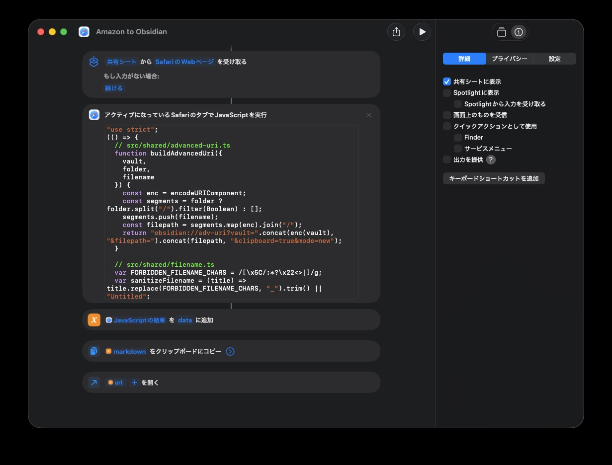

# iOS Safari ショートカットから Obsidian に登録する

iOS Safari の共有シートからショートカットを起動し、Amazon / ブクログの書誌情報を Obsidian Vault に Markdown として保存する手順です。

Chrome 拡張と同じスクリプト (`src/shared/`) を再利用しており、ショートカット用には `build/shortcut.js` をビルドして使います。完成済みの `obsidian://adv-uri?...` URL も JavaScript 側で組み立てるので、ショートカット側のアクションは最小限で済みます。

## 必要なもの

- iOS / iPadOS の Safari
- Obsidian (iOS 版) と [Advanced URI](https://github.com/Vinzent03/obsidian-advanced-uri) プラグイン
- 開いた Vault が iCloud / 同期で iOS デバイスに展開済みであること
- Node.js (ビルド用、Mac などの母艦で 1 度だけ実行)

## Vault / Folder の設定

`src/shortcut/config.ts` に保存先を書きます。初回 `npm run build` を実行すると `src/shortcut/config.example.ts` から自動でコピーされるので、その後で値を書き換えてください。`config.ts` は `.gitignore` で管理対象外です。

```ts
// src/shortcut/config.ts
export const VAULT = "MyVault"
export const FOLDER = "Books/Amazon"
```

- `VAULT` … Obsidian で開いている Vault 名 (Vault 一覧 URL の末尾と一致)
- `FOLDER` … Vault 内の保存先フォルダ。空文字列で Vault ルート、`/` 区切りで階層指定

日本語やスペースを含む場合もそのまま書いて問題ありません (JavaScript 側で `encodeURIComponent` します)。

複数の保存先を使い分けたい場合は、`config.ts` の値を切り替えながら都度 `npm run build` し、生成された `build/shortcut.js` を別ショートカットに貼り直す運用になります。

## ビルド

```sh
npm install
npm run build
```

`build/shortcut.js` が生成されます。中身は IIFE 形式の単一 JavaScript で、Safari の「Web ページで JavaScript を実行」アクションにそのまま貼り付けて使います。`config.ts` の値はビルド時にバンドル末尾へ埋め込まれるので、貼り付け後の手動編集は不要です。

## ショートカットの作成

iOS の「ショートカット」アプリで新規ショートカットを作成し、以下のアクションをこの順で並べます。完成形は次のキャプチャの通りです (Mac 版ショートカットでの編集画面)。



| #   | アクション                                               | 設定                                                                       |
| --- | -------------------------------------------------------- | -------------------------------------------------------------------------- |
| 1   | **`共有シート` から `SafariのWebページ` を受け取る**     | 共有シートに表示: ON / 受け付ける入力: **SafariのWebページ** のみ          |
| 2   | **アクティブになっているSafariのタブでJavaScriptを実行** | JavaScript: ビルド済みの `build/shortcut.js` の中身を貼り付け              |
| 3   | **`JavaScriptの結果` を `data` に追加**                  | 変数名 `data` (以降 `data.markdown` / `data.url` で各キーを参照)           |
| 4   | **`data.markdown` をクリップボードにコピー**             | コピーする内容: 変数 `data` を選択し「キーの値を取得」に `markdown` を入力 |
| 5   | **`data.url` を開く**                                    | 入力: 変数 `data` を選択し「キーの値を取得」に `url` を入力                |

## 共有シートからの実行

1. Safari で Amazon / ブクログの商品ページを開く
2. 共有ボタン → 作成したショートカットをタップ
3. クリップボードに Markdown 本文がコピーされ、Obsidian が起動
4. Advanced URI が指定パスに新規ノートを作成

同名ファイルがある場合は Advanced URI が `タイトル 1.md` のように連番を付与します。

## 動作確認のポイント

- 初回起動時に「"Amazon to Obsidian" に "{閲覧中のホスト名}"へのアクセスを許可しますか？」のダイアログが出ます。許可してください
- ショートカット実行直後にクリップボードを上書きするので、コピー中の内容があれば事前に退避を
- iOSの設定アプリでObsidianの「ほかのアプリからペースト: 許可」に設定しておくとペースト許可のダイアログが出なくなります。許可ダイアログが不要な場合は設定します

## スクリプトの再ビルド

`src/shared/` 配下のロジックや `src/shortcut/config.ts` を更新したら、Mac などで `npm run build` を再実行し、生成された `build/shortcut.js` の中身でアクション #2 の JavaScript を上書きしてください。Chrome 拡張側 (`build/popup.js` など) も同時に更新されます。
